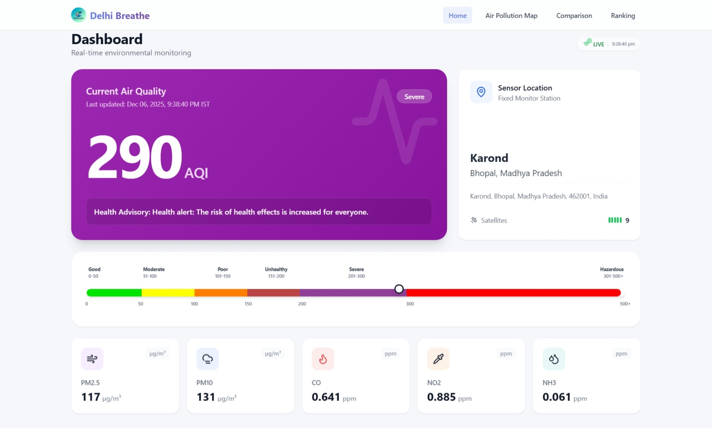

# Delhi Breathe 🌍

Real-time air quality monitoring system that displays environmental data from Firebase Realtime Database. Tracks PM2.5, PM10, CO, NO2, and NH3 levels with geolocation data.



## Features

- **Real-time Dashboard**: Live fetching of environmental sensor data.
- **Interactive Map**: View sensor locations and clustered readings on a map.
- **City Comparison**: Compare AQI trends across multiple cities with interactive charts.
- **Rankings**: View cities ranked by pollution levels.
- **AI Chatbot Assistant** 🤖: Voice and text-enabled chatbot with real-time data
  - Shows current AQI and pollutant levels from live sensors
  - 25+ FAQs about air quality, pollutants, and health
  - Voice input capability (Chrome/Edge)
  - Instant answers with health recommendations
  - Preventative measures and reduction strategies
- **Responsive Design**: Fully optimized for Desktop and Mobile experiences.
- **AQI Visuals**: Intuitive color-coded scales and health advisories.

## Tech Stack

- **Frontend**: React, Vite, TypeScript
- **Styling**: Tailwind CSS, PostCSS
- **Maps**: React Leaflet, OpenStreetMap
- **Charts**: Recharts
- **Icons**: Lucide React
- **Backend/Data**: Firebase Realtime Database

## Getting Started

### Prerequisites

- Node.js (v18+)
- npm or yarn

### Installation

1. Clone the repository
   ```bash
   git clone <repository-url>
   cd delhibreathe-vite
   ```

2. Install dependencies
   ```bash
   npm install
   ```

3. Configure Environment Variables
   Create a `.env` file in the root directory and add your Firebase config:
   ```env
   VITE_FIREBASE_API_KEY=your_api_key
   VITE_FIREBASE_AUTH_DOMAIN=your_project.firebaseapp.com
   VITE_FIREBASE_DATABASE_URL=https://your_project.firebaseio.com
   VITE_FIREBASE_PROJECT_ID=your_project_id
   VITE_FIREBASE_STORAGE_BUCKET=your_project.firebasestorage.app
   VITE_FIREBASE_MESSAGING_SENDER_ID=your_sender_id
   VITE_FIREBASE_APP_ID=your_app_id
   VITE_FIREBASE_MEASUREMENT_ID=your_measurement_id
   ```

4. Run Development Server
   ```bash
   npm run dev
   ```

5. Build for Production
   ```bash
   npm run build
   ```

## Project Structure

```
src/
├── components/     # Reusable UI components
│   ├── chatbot/    # AI Chatbot components
│   ├── home/       # Home page components
│   ├── layout/     # Layout components
│   ├── map/        # Map components
│   └── shared/     # Shared components
├── data/           # Static data and knowledge base
├── hooks/          # Custom React hooks (Data fetching)
├── pages/          # Route components
├── services/       # External service config (Firebase)
├── styles/         # Global styles and animations
├── types/          # TypeScript interfaces
└── utils/          # Helper functions (Formatters, AQI logic)
```

## Chatbot Features

The AI-powered chatbot assistant helps users understand air quality:

- **Real-Time Data**: Shows current AQI and pollutant values from live sensors
- **Voice Input**: Speak your questions naturally (Chrome/Edge)
- **Smart Responses**: Trained on comprehensive AQI knowledge
- **Quick Replies**: One-click access to common questions
- **Topics Covered**:
  - Current AQI and pollutant levels (real-time)
  - AQI basics and categories
  - All pollutants (PM2.5, PM10, CO, NO2, NH3)
  - Health effects and vulnerable groups
  - Reduction methods and protective measures
  - Air purifiers, masks, and safety guidelines

See [CHATBOT_README.md](CHATBOT_README.md) for complete documentation.

## Contributing

Pull requests are welcome. For major changes, please open an issue first to discuss what you would like to change.

## License

[MIT](LICENSE)
